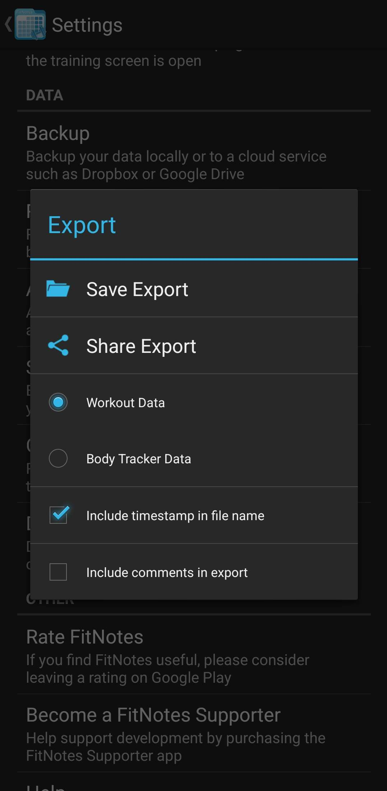

# FitNotes Wrapped

**Your yearly gains, visualized.**  
A self-hosted, containerized "Spotify Wrapped" style experience for your [FitNotes](https://play.google.com/store/apps/details?id=com.github.jamesgay.fitnotes&hl=en&gl=US) workout data.

---

## Getting Started

### 1. Export Your Data from FitNotes

You need to export your workout history as a CSV file.

1. Open the **FitNotes** app on your phone.
2. Tap the **Settings** (Gear icon) or Menu.
3. Select **Spreadsheet Export**.
4. Choose **Save to Device**.
5. Ensure you export **All Data** (CSV format).



### 2. Prepare the Project

1. Clone or download this repository.
2. Place your exported CSV file into the `data/` folder in the project root.
   - _Note: The app automatically detects the latest CSV file in this folder._

### 3. Run with Docker

This entire application is fully containerized. You only need Docker installed.

```bash
# Build and start the containers
docker compose up --build
```

### 4. View Your Wrapped

Open your browser and navigate to:
**[http://localhost:8080](http://localhost:8080)**

---

## Features

- **Consistency Stats**: Track your total workouts and longest daily streak.
- **Volume Visualization**: See your total tonnage lifted and monthly trends.
- **Advanced Insights**:
  - **No Days Off**: A GitHub-style contribution grid visualizing your daily consistency and intensity.
  - **The Grinder**: Automatic detection of your single hardest session of the year (by volume).
  - **Identity Badges**: Interactive personas based on your training habits.
- **Charts**:
  - **Weekly Rhythm**: Visualize your most popular training days.
  - **Muscle Split**: A breakdown of your body part focus.
- **PR Showcase**: Highlights your absolute heaviest lift of the year.

---

## Technology Stack

- **Frontend**: React, Vite, Framer Motion (Animations), Recharts (Data Viz).
- **Backend**: FastAPI (Python), Pandas (Data Processing).
- **Infrastructure**: Docker, Docker Compose, Nginx.

## Project Structure

```
fitnotes-wrapped/
├── assets/              # Images for README/UI
├── backend/             # FastAPI Python Service
│   ├── main.py          # API Logic & CSV Processing
│   └── Dockerfile
├── frontend/            # React App
│   ├── src/             # Components & Styles
│   └── Dockerfile
├── data/                # DROP YOUR CSV HERE
└── docker-compose.yml   # Orchestration
```
